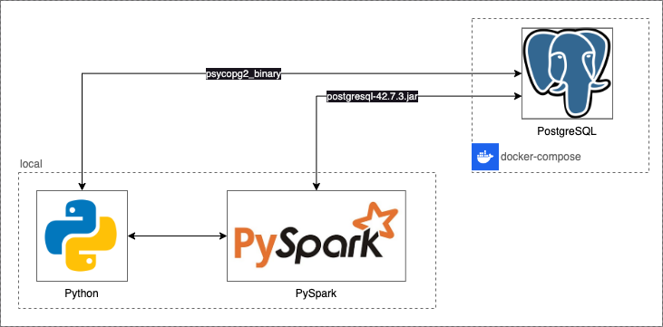
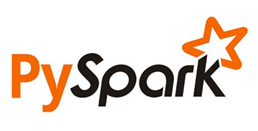
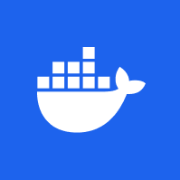
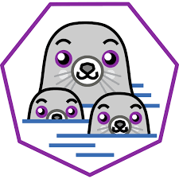
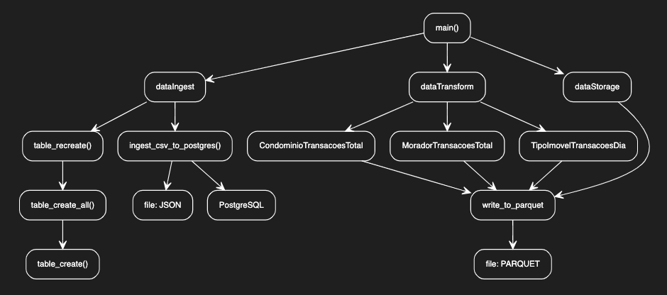
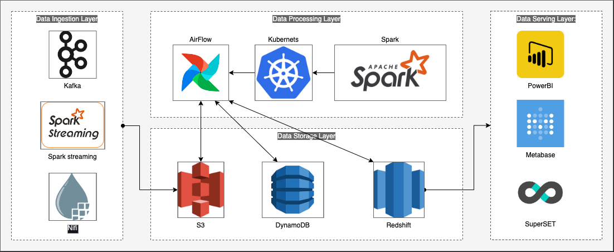

# Desafio Engenharia de Dados
Esse foi um desafio realizado para vaga de Engenharia de Dados utilizando Python, PySpark (+Streaming) e PostgreSQL.

### Como instalar
* Clone o projeto: 
  ```
  git@github.com:rudaruda/spl_eng_dados_teste.git
  ```
* Necessário ter Docker e Docker-compose (ou Podman + Podman Compose) instalado
* Utilizar o comando `docker-compose up` ou `podman-compose up` no diretório do repositório


#### Serviços instalados em container
  - **PostgrSQL**: http://localhost:5452/
    > _user: `admin`, password: `admin`_


# Arquitetura dessa Solução


Localmente temos o Python e PySpark e PostgreSQL instalado com docker-compose para facilitar os testes. A conexão do Python com PostgreSQL acontece via biblioteca psycopg2_binary. E do PySpark com PostgreSQL acontece via JDBC "postgresql-42.7.3.jar".

O recurso de Spark Structured Streaming (readStream e writeStream) são consumidos no arquivo `streaming.py` no diretório "app/dataIngest/".


| :city_sunrise: |Aplicação| O que é|
|-----|:-----:|-------------|
|  | **[PostgreSQL](https://jdbc.postgresql.org/download/)**| Banco de dados relacional (SGBD) de código aberto. Ele é conhecido por ser robusto, altamente extensível.|
|  | **[PySpark](https://spark.apache.org/docs/latest/api/python/index.html)** | Interface Python para o Apache Spark, usada para processamento distribuído de grandes volumes de dados em cluster |
|  | **[Docker](https://www.docker.com/get-started/)** | Plataforma para criar, distribuir e executar aplicações em contêineres isolados.|
|  | **[Podman](https://podman.io/get-started)** | Alternativa para executar container em relação ao Docker. Consome menos recursos de máquina no desenvolvimento local ***(super recomendo!)*** :rocket:.|


## Como usar...

1. **Instale imagem do PostgreSQL**

   Estando no diretório do projeto, com **Docker** ou **Podman**:

   | Docker | Podman |
   |--------|--------|
   | ```docker-compose up``` | ```podman-compose up``` |

2. **Ambiente virtual**

   É recomendável que faça a execução dentro do ambiente virtual do python.
   
   O **Poetry** faz isso de forma mais automatica com o comando:
   ```
   poetry run python <file.py> <args>
   ```

   Porém, é necessário ter ele instalado... para instalar digite o comando:
   ```
   pip install poetry
   ```

   O jeito tradicional de ativar o ambiente virtual é com o comando:
   ```
   source .venv/bin/activate
   ```


3. **Instale as bibliotecas do Python**

   Estando no diretório do projeto, instale com **pip** ou **Poetry**:

   | pip | Poetry |
   |:-----------:|:--------------:|
   | ```pip install -r requirements.txt``` | ```poetry install```|

3. **Execute a PIPELINE**

   Estando no diretório do projeto, com Python:

   | Python | Python + Poetry|
   |:-------------:|:-----------:|
   | ```python app/main.py pipeline``` | ```poetry run python app/main.py pipeline``` |

   Esse comanado irá executar a pipeline completa: Ingestão > Transformação > Armazenamento.

   Os dados transformados em **PARQUET** serão salvos no diretorio **parquet-files** na razi do projeto.

   

3. **Execute o STREAMING**
   Estando no diretório do projeto, com Python:

   | pip | Poetry |
   |:-----------:|:--------------:|
   | ```python app/dataIngest/streaming.py``` |```poetry run python app/dataIngest/streaming.py``` |

   Para o streaming funcionar é preciso que haja arquivos no diretório **app/data-files-enter**.
   
   Existe massa de teste no diretório **pp/data-files**.
   
   Copie todos arquivos (ou se quiser um a um) coloque uma cópia em **app/data-files-enter**.

   


## Diagrama funcional



Temos o main() que acessao a camada de Tngestão e executa o metodo table_recreate para criar as tabelas (condominios, imoveis, moradores e transacoes) no PostgreSQL.

Em sequencia temos a camada de Transformação que execeuta métodos para transformar os dados ingeridos em outros dados (relatórios).

Por último temos a cama de Storage que persiste os dados "transformados" em arquivo PARQUET.

# Arquitetura Proposta

> Desenhe uma arquitetura de Lake House para a CondoManage que minimamente inclua as seguintes camadas:
- **Data Ingestion Layer**: Ingestão de dados de várias fontes (arquivos CSV, APIs, etc.).
- **Data Storage Layer**: Armazenamento de dados brutos e processados em um Data Lake.
- **Data Processing Layer**: Processamento de dados usando Spark.
- **Data Serving Layer**: Exposição de dados processados para análise.)

> ##### Resposta



Na camada ***"Data Ingestion Layer"*** considerei o **Kafka** que é uma poderosa aplicação para transferencia de dados entre SQL e NoSQL. O **Spark Streaming** para ingestão de arquivos/logs em tempo real. e o **Nifi** que tem suporte a Webhooks/Apis nativamente.

Em ***"Data Storage Layer"*** considerei o **S3** para armazamento de todos os tipos de dados (estruturados e não estruturados) nele ainda podemos aplicar a governança de medalhão (bronze, prata e ouro). **DynamoDB** pode ser muito útil na camada prata quando o volume do dado é muito alto e precisamos de mais velociade. **RedShift** é uma excelente opção quando precisamos armazenar nossos dados estruturados, porque ele atende tanto a questão de alto volume quanto a o de alta velocidade com consultas simultanes á um custo considerado "preço justo".

Para processar nosso dados em ***"Data Processing Layer"*** considerei o **AirFlow** como orquestrador, para schedular as rotinas com monitoramento e gestão visual das DAGs. Ele esta conectado ao **Kubernets** o que garantirá o escalabilidade, com imagens do **Spark** para processar todo nosso fluxo de dados que estão conectado com a camada de _"Data Storage Layer"_.

Na última camada ***"Data Serving Layer"*** inclui o **PowerBI** por ser uma ferramenta de advanced analytics da _Microsoft_ com usabilidade familiar do Excel (as da área de négocio gostam dele). O **Metabase** que é _open source_ pela facilidade de compartilhar indicadores e realizar trabalho de exploração de dados. Inclui o **SuperSet** que também é _open source_ por ser mais flexivel que o _Metabase_ e possuir mais opções de visualização. Essas tres ferramentas garantem a disponibilidade do dados em diversos formatos para as área de negócio.


# Documentação
> Descreva como você documentaria o design e a implementação da arquitetura e dos pipelines.

> ##### Resposta:

É essencial ter uma ferramenta de comunicação Global. O Confluencia ajuda, mas penso que o **Microsoft SharePoint** em conjunto com outros documentos executivos deve conter diagramas de Arquitetura Macro das soluções legadas assim como esquema de macro de Governança de Dados o **MDM**.

No **GitHub** precisa estar armazenado todos os scripts e todas as querys (relatórios) de alto impacto para a empresa. Podemos até pensar em algum **Feature Manager** como o **OpenFeature** para gerenciar o versionamento de cada indicador relevante para o negócio e para processos de IA. 

Ainda no **README do Github** importante estar o link dos épicos do **Jira**, eles ajudam a explicar sobre a evolução do serviço/produto. Vejo que é cada vez mais essencial ter documentaçao do **DBML** (diagramas de entidade e relacionamento) também no **README do Github** para processos de dados.

**JIRA** para documentar cada ação evolutiva sobre o processo da pipeline, como a inclusão ou remoção de DAGs.

E sobre o **DBML** eu faria uso do **DBdocs** que ajuda muito a registrar a explicação dos objetos de dados com o negócio.

**Swagger** para alguns processos de pipeline e consulta de dados, vejo que pode fazer sentido contruir uma saída em API para ter o Swagger em mãos, por ele disponiliza uma documentação dinamica e prática ao mesmo tempo.

No **Confluence** precisa estar documentado sobre todo o processo de como é confeccionado/desenvolvido o fluxo de documentação com as diversas ferramentas. Com diagramas de **TOGAF** que unem componentes de Fluxo de Negócio com elementos de TI (como servidores e banco de dados).

Documentação nunca é demais mas é preciso que haja sinergia entre os documentos, para que não haja comunicação incoerente entre os diversos artefatos de documentação.

# Monitoramento
> Descreva como você montaria uma camada de monitoramento e alertas para os pipelines de dados usando ferramentas como Apache Kafka, Apache Airflow, ou AWS Glue.

> ##### Resposta:

Com o Kafka temos muitas alternativas para monitoramento temos o **Control Center** da própria Confluent. 
Mas o jeito "raiz" é com **Prometheus + Grafana** para capturar logs, criar metricas e criar alertas. 
O **ELK Stack** pode ser alternativa mais elegante para criar o processo de monitoramento dos serviços, por causa do **Kibana** com navegação/exploração de dados com dashborads e o **Elastic Search** que é poderoso processamento de consulta de logs.

A quesão é que para toda essa stack de monitoramento, é exigido um infra pesada e separada dos demais ambientes, para garantir monitoramento esteja sempre disponível mesmo que os outros serviços tenham queda.

No AirFlow configuramos ações para os eveitos de `on_failure_callback`, `on_success_callback` e `email_on_failure`. Fora isso podemos configurar o Grafana para ler os logs do AirFlow e criar dashboards.

O **AWS Glue** é o mais fácil porque tem como habilitar o **Cloud Watch** da própria AWS que facilita e resume todo o trabalho de Monitoramento.