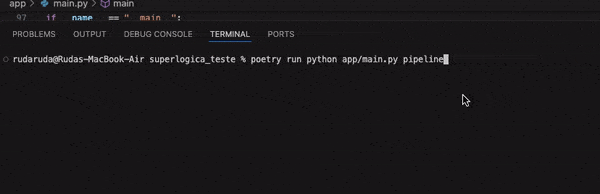
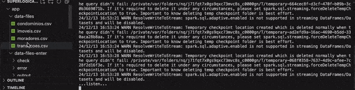

# spl_eng_dados_teste
Teste realizado para vaga de Engenharia de Dados


### Como instalar
* Necessário ter Docker e Docker-compose (ou Podman + Podman Compose) instalado
* Utilizar o comando `docker-compose up` ou `podman-compose up` no diretório do repositório


#### Serviços instalados em container
  - **PostgrSQL**: http://localhost:5452/
    > _user: `admin`, password: `password`_


# Arquitetura dessa Solução


## Como usar...

1. **Instalar a imagem do PostgreSQL**

  Estando no diretório do projeto, com Docker:
   ```
   docker-compose up
   ```
   ... ou Podman:
   ```
   podman-compose up
   ```

2. **Instale as bibliotecas**

   É recomendavel que faça a execução dentro do ambiente virtual do python.
   
   O poetry faz isso de forma mais automatica com o comando:
   ```
   poetry run python <file.py> <args>
   ```

   Porém, é necessário ter ele instalado... para instalar digite o comando:
   ```
   pip install poetry
   ```

   O jeito tradicional ativar o ambiente virtual é com o comando:
   ```
   source .venv/bin/activate
   ```


3. **Instale as bibliotecas**

   Estando no diretório do projeto, com pip:
   ```
   pip install -r requirements.txt
   ```
   ... ou Poetry:
   ```
   poetry install
   ```

3. **Execute a PIPELINE**

   Estando no diretório do projeto, com Python:
   ```
   python app/main.py pipeline
   ```
   ... ou com Poetry:
   ```
   poetry run python app/main.py pipeline
   ```

   Esse comanado irá executar a pipeline completa: Ingestão > Tranformação > Armazenamento.

   Os dados transformados em **PARQUET** serão salvos no diretorio **parquet-files** na razi do projeto.

   

3. **Execute o STREAMING**
   Estando no diretório do projeto, com Python:
   ```
   python app/dataIngest/streaming.py
   ```
   ... ou com Poetry:
   ```
   poetry run python app/dataIngest/streaming.py
   ```

   Para o streaming funcionar é preciso que haja arquivos no diretório **app/data-files-enter**.
   
   Existe massa de teste no diretório **pp/data-files**.
   
   Copie todos arquivos (ou se quiser um a um) coloque uma cópia em **app/data-files-enter**.

   


